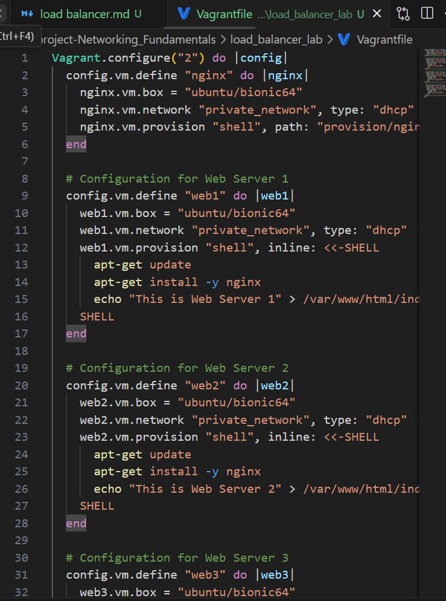
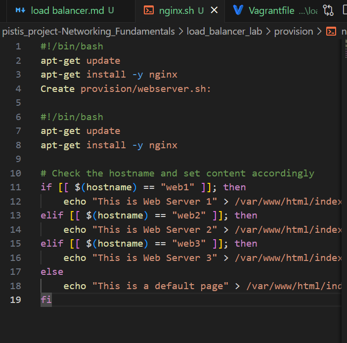

# Creating a Load Balancer Lab with Nginx and Multiple Vagrant Servers

1. **Prepare the Lab Directory.**

```
mkdir load_balancer_lab
cd load_balancer_lab
```

2. **Set Up Vagrant Configuration.**
This is done after `vagrant init` 


3. Create Provisioning Scripts
Create provisioning scripts for Nginx and the web servers.
Create `provision/nginx.sh`



4. **Initialize and Start Vagrant Machines.**
Navigate to your project directory and run the following command: `vagrant up`
This will initialize and start the Nginx and web server virtual machines based on your Vagrant configuration.

5. **Configure Nginx Load Balancer.**
SSH into the Nginx virtual machine: `vagrant ssh nginx` .
Edit the Nginx configuration file to set up load balancing: `sudo nano /etc/nginx/sites-available/default` . Edit the file to include the following configuration inside the server block:
```
location / {
    proxy_pass http://web_servers;
}
upstream web_servers {
    server <web1_ip>:80;
    server <web2_ip>:80;
    server <web3_ip>:80;
}
```

I commented out the first location

6. **Test the Load Balancer**
I tested it out and with the vagrant Ip address and it worked!


7. **Verify Load Balancing**: `vagrant ssh web1`


